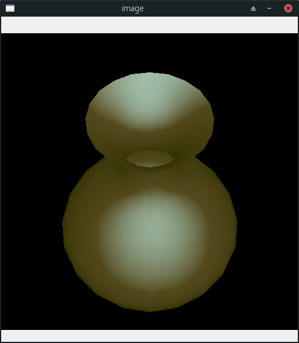

# cgb_ufrpe


Projeto da disciplina de Computação Gráfica Básica ministrada na UFRPE no semestre de 2020.1.

## Índice

1. [Especificação do Projeto](#especificação-do-projeto)
2. [Instalação](#instalação)
3. [Como executar o projeto](#como-executar-o-projeto)

## Especificação do Projeto

Carregar na memória uma malha de triângulos referente a um objeto 3D armazenada em arquivo de texto e desenhar seus vértices na tela. O arquivo utilizado para armazenar uma malha com **n vértices** e **k triângulos** possui o seguinte formato:

```
<no de vértices> <no de triângulos>
<coordenada x do vértice 1> <coordenada y do vértice 1> <coordenada z do vértice 1>
<coordenada x do vértice 2> <coordenada y do vértice 2> <coordenada z do vértice 2>
...
<coordenada x do vértice n> <coordenada y do vértice n> <coordenada z do vértice n>
<índice do vértice 1 do triângulo 1> <índice do vértice 2 do triângulo 1> <índice do vértice 3 do triângulo 1>
<índice do vértice 1 do triângulo 2> <índice do vértice 2 do triângulo 2> <índice do vértice 3 do triângulo 2>
...
<índice do vértice 1 do triângulo k> <índice do vértice 2 do triângulo k> <índice do vértice 3 do triângulo k>
```

Uma vez que a malha foi carregada na memória, deve-se obter a projeção em perspectiva de seus vértices.

A aplicação deverá carregar a partir de um arquivo de texto os seguintes parâmetros da
câmera virtual e de iluminação:

| Parâmetro | Exemplo | Tipo | Descrição |
| :---: | :---: | :---: | :--- |
| N | (0,1.5,-1) | Vetor | Base ortonormal que determina o sistema de coordenadas de vista |
| V | (0,-1,-1) | Vetor | Base ortonormal que determina o sistema de coordenadas de vista |
| d | 7 | Escalar | Determina a ditancia do foco ao plano de vista |
| hx | 2 | Escalar | Tamanho do retangulo de vista |
| hy | 2 | Escalar | Tamanho do retangulo de vista |
| C | (0,-400, 400) | Ponto | Ponto de foco C |
| Ka | 0.2 | Escalar | Coeficiente de iluminação ambiental, valor de 0 até 1 |
| Iamb | (255,247,0) | Cores RGB | Cor da luz ambiental |
| Il | (127,213,254) | Cores RGB | Cor da luz que incide sobre o objeto |
| Kd | (0.5,0.3,0.2) | Vetor | Coeficiente de reflexão difusa do objeto, valor entre 0 e 1 |
| Od | (0.7,0.5,0.8) | Vetor | Cor difusa do objeto, valor entre 0 e 1 |
| Ks | 0.5 | Escalar | Coeficiente de reflexao especular do objeto, varia de 0 até 1 |
| n | 1 | Escalar | Modela o tamanho do destaque especular, valor é maior ou igual a 1 |
| Pl | (60,5,-10) | Ponto | Posição da luz |


O usuário deve ser capaz de alterar os valores dos parâmetros no arquivo de texto, recarregá-los e redesenhar o objeto sem precisar fechar a aplicação e abri-la novamente (ex: o usuário pode pressionar uma tecla específica para recarregar os parâmetros a partir do arquivo de texto e redesenhar o objeto).

Deve-se converter os vértices do objeto de coordenadas mundiais para coordenadas de vista, realizar a projeção em perspectiva, converter para coordenadas normalizadas e por fim para coordenadas de tela. Após isso, deve-se utilizar o algoritmo de rasterização de polígonos scan line conversion (varredura) para preencher os triângulos projetados. Os pixels da tela correspondentes aos triângulos projetados e preenchidos devem ser pintados de acordo com o algoritmo de tonalização e iluminação de Phong.


## Instalação

O projeto foi todo desenvolvido em Python 3.8.2, além disso, foi utilizado algumas bibliotecas externas para auxiliar em operações algebricas e desenhar pixels na tela. Por causa disso, é preciso que você crie um ambiente virtual utilizando o [virtualenvwrapper](https://virtualenvwrapper.readthedocs.io/en/latest/), você também pode utilizar outro gerenciador de ambiente virtual.

Após configurar seu ambiente virtual Python com a versão 3.8.2 e ativa-lo, execute:

```bash
$ pip install -r requirements.txt
```

Pronto, os pacotes necessários foram instalados!

## Como executar o projeto

Para executar o projeto você precisará verificar alguns pontos:

1. O ambiente virtual está ativado?
2. As configurações de câmera foram informadas corretamente no arquivo `config-camera.env`?
3. A malha 3D desejada está no diretório `figure/` ?

> No diretório `files/` você encontra arquivos contendo malhas 3D válidas. E o arquivo `.env` não precisa ser alterado, apenas se você alterar as variáveis padrões do projeto.

Após esses passos serem conferidos, você irá executar no terminal o comando:

```bash
$ python main.py
```

Ele irá executar o projeto principal e após pronto você verá na tela uma janela como essa do exemplo.



> Esse exemplo foi gerado com a imagem vaso.byu e as configurações de câmera:
N=(0,1.5,-1)
V=(0,-1,-1)
d=7
hx=2
hy=2
C=(0,-400, 400)
Ka=0.2
Iamb=(255,247,0)
Kd=(0.5,0.3,0.2)
Od=(0.7,0.5,0.8)
Il=(127,213,254)
Ks=0.5
n=1
Pl=(60,5,-10)

Caso você deseje, você pode alterar o **arquivo de configuração ( `config-camera.env`) ou mudar de arquivo `.byu` sem encerrar o programa**. Para isso, com a janela da figura de saida em foco, pressione qualquer tecla. Após isso, você verá no terminal a seguinte mensagem: `Você deseja recarregar a figura com novos parâmetros? (1 - Sim, 0 - Não)`. Altere o arquivo `config-camera.env` com novos valores, digite `1` no terminal e pressione `enter`. Pronto! Será carregado a figura com novos valores de configuração. Para sair do programa, é só digitar `0` quando a mensagem aparecer novamente.
