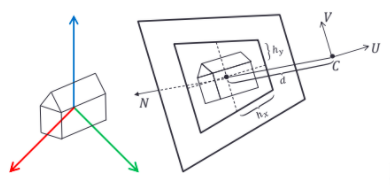

# cgb_ufrpe


Projeto da disciplina de Computação Gráfica Básica ministrada na UFRPE no semestre de 2020.4.

## Índice

1. [Especificação do Projeto](#especificação-do-projeto)
2. [Instalação](#instalação)
3. [Como executar o projeto](#como-executar-o-projeto)

## Especificação do Projeto

Carregar na memória uma malha de triângulos referente a um objeto 3D armazenada em arquivo de texto e desenhar seus vértices na tela. O arquivo utilizado para armazenar uma malha com **n vértices** e **k triângulos** possui o seguinte formato:

```
<no de vértices> <no de triângulos>
<coordenada x do vértice 1> <coordenada y do vértice 1> <coordenada z do vértice 1>
<coordenada x do vértice 2> <coordenada y do vértice 2> <coordenada z do vértice 2>
...
<coordenada x do vértice n> <coordenada y do vértice n> <coordenada z do vértice n>
<índice do vértice 1 do triângulo 1> <índice do vértice 2 do triângulo 1> <índice do vértice 3 do triângulo 1>
<índice do vértice 1 do triângulo 2> <índice do vértice 2 do triângulo 2> <índice do vértice 3 do triângulo 2>
...
<índice do vértice 1 do triângulo k> <índice do vértice 2 do triângulo k> <índice do vértice 3 do triângulo k>
```

Uma vez que a malha foi carregada na memória, deve-se obter a projeção em perspectiva de seus vértices.

A aplicação deverá carregar a partir de um arquivo de texto os seguintes parâmetros da
câmera virtual:
* Ponto C;
* Vetores N e V;
* Escalares d, hx e hy.

Exemplo de parâmetros de câmera:
```
N = 0 1 -1
V = 0 -1 -1
d = 5
hx = 2
hy = 2
C = 0 -500 500
```



> hx, hy: escalares que determinam o retângulo de vista.
> C: ponto de foco
> d: escalar que define distância do foco ao plano de vista
> U, V, N : base ortonormal que determina sistema de coordenadas de vista


O usuário deve ser capaz de alterar os valores dos parâmetros no arquivo de texto, recarregá-los e redesenhar o objeto sem precisar fechar a aplicação e abri-la novamente (ex: o usuário pode pressionar uma tecla específica para recarregar os parâmetros a partir do arquivo de texto e redesenhar o objeto).

Deve-se converter os vértices do objeto de coordenadas mundiais para coordenadas de vista, realizar a projeção em perspectiva, converter para coordenadas normalizadas e por fim para coordenadas de tela. Após isso, deve-se utilizar o algoritmo de rasterização de polígonos scan line conversion (varredura) para preencher os triângulos projetados. Os pixels da tela correspondentes aos triângulos projetados e preenchidos devem ser pintados de branco, enquanto que os demais pixels devem ser pintados de preto.

A única função gráfica que pode ser utilizada é a que desenha um pixel colorido na tela. Apenas as bibliotecas padrão da linguagem escolhida podem ser usadas.

OBS.: caso desejado, é permitido usar uma biblioteca externa que ofereça a função de pintar um pixel colorido na tela.

## Instalação

O projeto foi todo desenvolvido em Python 3.8.2, além disso, foi utilizado algumas bibliotecas externas para auxiliar em operações algebricas e desenhar pixels na tela. Por causa disso, é preciso que você crie um ambiente virtual utilizando o [virtualenvwrapper](https://virtualenvwrapper.readthedocs.io/en/latest/), você também pode utilizar outro gerenciador de ambiente virtual.

Após configurar seu ambiente virtual Python com a versão 3.8.2 e ativa-lo, execute:

```bash
$ pip install -r requirements.txt
```

Pronto, o pacotes necessários foram instalados!

## Como executar o projeto

Para executar o projeto você precisará verificar alguns pontos:

1. O ambiente virtual está ativado?
2. As configurações de câmera foram informadas corretamente no arquivo `config-camera.env`?
3. A malha 3D desejada está no diretório `figure/` ?

> No diretório `objects/` você encontra 7 arquivos contendo malhas 3D válidas. E o arquivo `.env` não precisa ser alterado, apenas se você alterar as variáveis padrões do projeto.

Após esses passos serem conferidos, você irá executar no terminal o comando:

```bash
$ python main.py
```

Ele irá executar o projeto principal e após pronto você verá na tela uma janela como essa do exemplo.


> Esse exemplo foi gerado com a imagem calice2.byu e as configurações de câmera: N=(0,1,-1)
V=(0,-1,-1)
d=5
hx=2
hy=2
C=(0,700,-500)

Caso você deseje, você pode alterar o arquivo de configuração `config-camera.env` sem encerrar o programa. Para isso, com a janela da figura de saida em foco, precione qualquer tecla. Após isso, você verá no terminal a seguinte mensagem: `Você deseja recarregar a figura com novos parâmetros? (1 - Sim, 0 - Não)`. Altere o arquivo `config-camera.env` com novos valores, digite `1` no terminal e precione `enter`. Pronto! Será carregado a figura com novos valores de configuração. Para sair do programa, é só digitar `0` quando a mensagem aparecer novamente.
